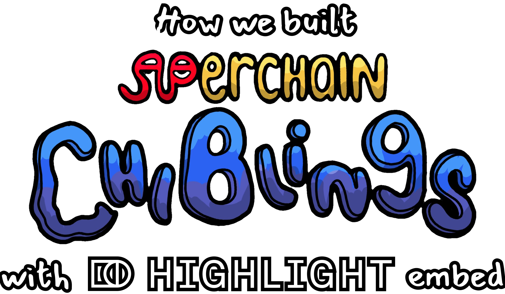
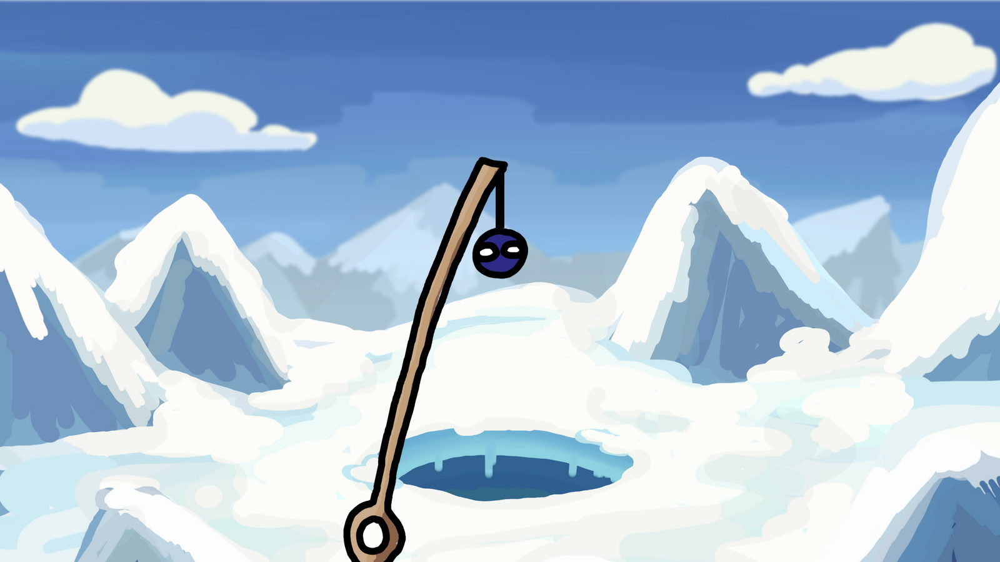
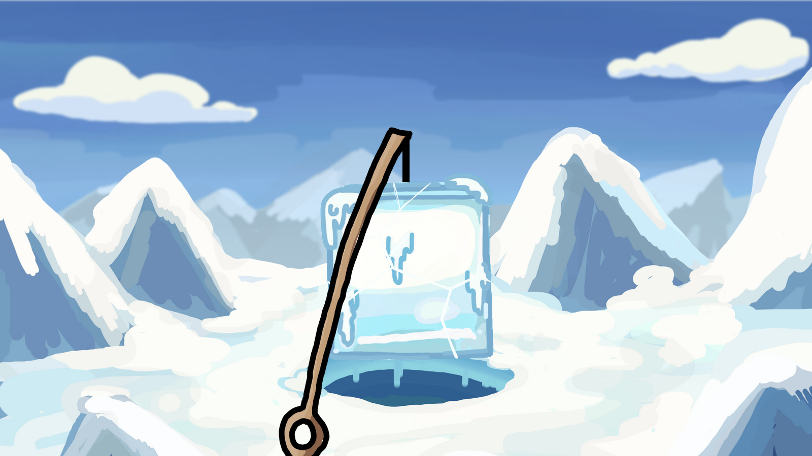
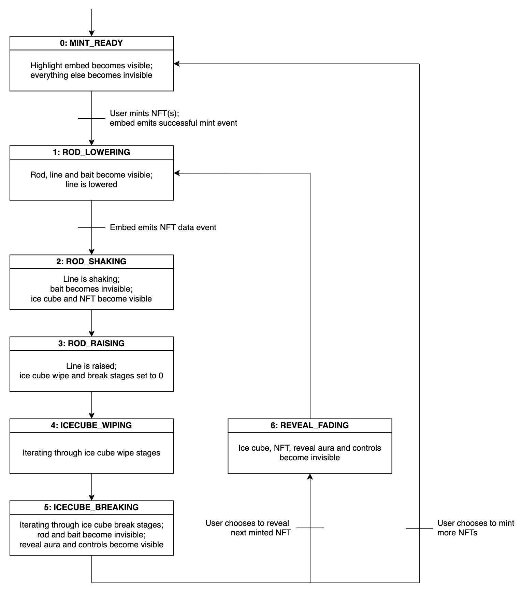
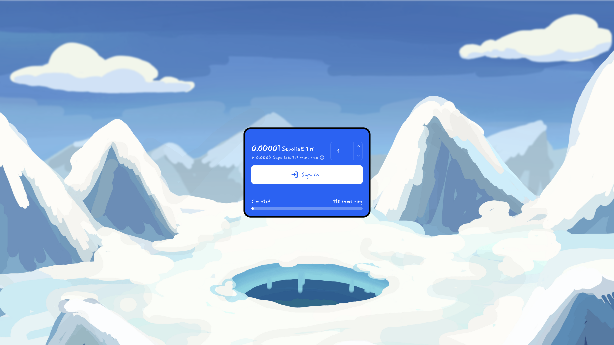

<p align="center">
  
</p>
<hr/>

## Introduction

Superchain Chiblings ([Highlight page](https://highlight.xyz/mint/66a10e2da960c995e3019817)) is an NFT art collection of 20,000 characters created by Secretpikachu ([X/Twitter](https://x.com/ttyl5h/)). To enhance the project's minting experience, they partnered with bartosjiri ([X/Twitter](https://x.com/bartosjiri_)) to develop a custom website for the project.

The following is bartosjiri's breakdown of the website development, utilizing Highlight's embed feature ([docs](https://support.highlight.xyz/knowledge-base/for-creators/selling-your-nfts/sell-on-your-own-site-using-embeds)).

If you'd like to collaborate with them on your project, feel free to get in touch ([X/Twitter](https://x.com/bartosjiri_), [website](https://bartosjiri.com)).

<hr/>

## Guide

We will recreate the entire website in React step-by-step, from start to end. The repository's main branch contains the complete source code, with each finished step in a separate branch for reference.

### Step 0: Initializing the project

To initialize the project, we will use the PNPM package manager ([website](https://pnpm.io/)) to scaffold a basic Vite+React project ([docs](https://vitejs.dev/guide/#scaffolding-your-first-vite-project)). However, feel free to use any of your preferred tools.

Let's set up the project by running the following command:

```
pnpm create vite superchainchiblings-demo --template react-ts
```

Navigate to the project's repository and installthe additional libraries we will be using:

- sass ([npmjs](https://www.npmjs.com/package/sass)): SCSS styles support
- zustand ([npmjs](https://www.npmjs.com/package/zustand)): simple state management
- howler ([npmjs](https://www.npmjs.com/package/howler)): reliable audio handling

```
pnpm add -D sass zustand howler @types/howler
```

The Vite template provided some code that we won't need, so let's also remove that:

- Delete `src/assets`, `/public/vite.svg`, `src/App.css`, and `src/index.css`.
- Remove the `./index.css` import from `src/main.tsx` and all imports in `src/App.tsx`.
- Remove the count state and all markup in the `src/App.tsx` file.

### Step 1: Setting up base layout

First, we will need all our image and sound assets. They are included in the repository of this guide in the `/public` folder. Just download them and place them in the same directory in our project.

Next, we'll want to configure some underlying styles. Create a CSS reset file at `src/styles/reset.scss` and paste in the reset style rules ([file](./src/styles/reset.scss)), which reduce inconsistencies across different browsers.

Also create the `src/styles/general.scss` file, where we will import an external font and set up some more default styles:

###### src/styles/general.scss

```scss
@import url("https://fonts.googleapis.com/css2?family=Mansalva&display=swap");

:root {
  font-size: 62.5%;
}

html,
body {
  height: 100%;
}

body {
  font-family: "Mansalva", -apple-system, "Segoe UI", sans-serif;
  -webkit-font-smoothing: antialiased;
  -moz-osx-font-smoothing: grayscale;
  text-rendering: optimizeLegibility;
  -webkit-tap-highlight-color: transparent;

  a {
    outline: 0;
    text-decoration: none;
  }

  ::selection {
    background: transparent;
  }
}
```

Make sure to import both new files in the main application file:

###### src/App.tsx

```tsx
import "./styles/reset.scss";
import "./styles/general.scss";

function App() {
  return <></>;
}

export default App;
```

With that done, we can start crafting our base layout. We'll set up the scene with an environment, containing two layers to create a sense of depth:

###### src/modules/environment/Environment.tsx

```tsx
import "./Environment.scss";

const Environment = () => (
  <>
    <div className="environment background">
      
      
      
    </div>
    <div className="environment foreground">
      
      
      
    </div>
  </>
);

export default Environment;
```

###### src/modules/environment/Environment.scss

```scss
.environment {
  position: fixed;
  display: flex;
  justify-content: center;
  left: 50%;
  transform: translateX(-50%);

  img {
    display: block;
    max-height: 100vh;
    min-width: 50%;

    &.filler {
      position: fixed;
      top: 0;
      bottom: 0;
      height: 100vh;
      width: 100vw;
      z-index: -1;

      &.left {
        right: 50%;
      }

      &.right {
        left: 50%;
      }
    }
  }

  &.background {
    filter: blur(2px);
    z-index: 1;
  }

  &.foreground {
    transform: translateX(-50%) scale(1.15);
    z-index: 2;
  }
}
```

###### src/App.tsx

```tsx
import Environment from "./modules/environment/Environment";

import "./styles/reset.scss";
import "./styles/general.scss";

function App() {
  return (
    <>
      <Environment />
    </>
  );
}

export default App;
```

You can see that for each layer we have 3 images. We want to cover the whole screen, even if the user has an ultra wide monitor. That's why we add an extra 1px wide slice image to each side of the given layer image, which is then stretched to the remaining width of the screen:


For the background layer, we add some blur to make it appear more distant. For the foreground layer. we apply some scaling transformation, which is a useful technique when aassets provided by the artist are little bit too small or large for our desired look.

### Step 2: Adding objects

In this step, we will start adding all the necessary components to the scene. It might look very chaotic at first, but don't worry, in next steps we will clean everything up.

We will start with the rod, which consists of the blank, line, bait, and attached content:

###### src/modules/rod/Rod.tsx

```tsx
import styles from "./Rod.module.scss";

type RodPropsT = {
  children?: React.ReactNode;
};

const Rod = ({ children }: RodPropsT) => {
  return (
    <div className={styles.rod}>
      
      <div className={`environment foreground ${styles.mask}`}>
        
      </div>
      <div className={styles.line}>
        <div className={styles.string} />
        <div className={styles.bait}>
          
        </div>
        <div className={styles.content}>{children}</div>
      </div>
    </div>
  );
};

export default Rod;
```

###### src/modules/rod/Rod.module.scss

```scss
.rod {
  position: fixed;
  bottom: 0;
  left: 50%;
  height: 100%;
  display: flex;
  justify-content: center;
  transform: translateX(-50%);
  width: 190vh;
  z-index: 3;

  img {
    position: absolute;
    bottom: 0;
    display: block;
    width: 100%;
    left: 0.5%;
    transition: opacity 0.33s;
    z-index: 4;
  }

  .mask {
    img {
      position: relative;
      bottom: initial;
      left: initial;
      width: initial;
    }
  }

  .line {
    position: fixed;
    top: 30%;
    bottom: 0;
    display: flex;
    justify-content: center;
    width: 40vh;
    transform-origin: center top;
    transition: transform 0.5s;
    z-index: -1;

    .string {
      position: absolute;
      top: 0;
      width: 1.5vh;
      height: 100%;
      background: #010101;
      transform: scale3d(1, 15%, 1);
      transform-origin: top;
      transition: opacity 0.33s;
    }

    .bait {
      position: absolute;
      top: 0;
      left: 50%;
      width: 10vh;
      height: 100%;
      transform: translate3d(-50%, 15%, 0);
      transition: opacity 0.33s;

      img {
        top: 0;
      }
    }

    .content {
      position: relative;
      width: 100%;
      transform: translate3d(0, 15%, 0);
    }

    .string,
    .bait,
    .content {
      transition: transform 0.5s;
    }
  }
}
```

###### src/App.tsx

```tsx
import Environment from "./modules/environment/Environment";
import Rod from "./modules/rod/Rod";

import "./styles/reset.scss";
import "./styles/general.scss";

function App() {
  return (
    <>
      <Environment />
      <Rod />
    </>
  );
}

export default App;
```

The wrapping rod component is centered into the middle of the screen, where the hole in the ice in our scene is located. The line goes from the end of the blank to the bottom of the screen; however, at first, it does not seem to be properly alligned. Notice that we again compensate the positioning with `left: 0.5%` for the blank image - if such small modifications are possible, it's better that having to edit the image or asking the artist for modifications.

There’s also one element from the environment assets used to block the content that appears to be in the hole. We want to position it between the rod, which is in front of it, and everything else, which will be hidden behind it.



You might be wondering why all sizes are in `vh` units. Since our environment is designed to scale vertically, we use the same sizing approach in the rest of our project for consistent behavior.

The line component hosts the line string, the bait, but most importantly, all the attached content. We want all content to fit into the hole in the ice, so we set `width: 40vh`, which corresponds to the size of the hole in our scene.

Most of our components already have transform and transition rules because we will be animating these in the following steps.

Next up is the ice cube, which will hold all our minted NFTs:

###### src/modules/ice-cube/IceCube.tsx

```tsx
import styles from "./IceCube.module.scss";

type IceCubePropsT = {
  children?: React.ReactNode;
};

const IceCube = ({ children }: IceCubePropsT) => {
  return (
    <div className={styles.iceCube}>
      <div className={styles.mask}>
        {Array.from({ length: 6 }).map((_, index) => (
          
        ))}
        {Array.from({ length: 7 }).map((_, index) => (
          
        ))}
      </div>
      <div className={styles.content}>{children}</div>
    </div>
  );
};

export default IceCube;
```

###### src/modules/ice-cube/IceCube.module.scss

```scss
.iceCube {
  position: relative;
  top: -5%;
  display: flex;
  width: 100%;
  height: 100%;

  .mask {
    position: relative;
    display: flex;
    width: 100%;

    img {
      position: absolute;
      top: 0;
      display: block;
      width: 100%;
      transition: opacity 0.33s, transform 0.66s;

      &.broken {
        &[data-break="1"] {
          transform: translate3d(-32%, -32%, 0) rotate(-31deg);
        }

        &[data-break="2"] {
          transform: translate3d(-6%, -45%, 0) rotate(-16deg);
        }

        &[data-break="3"] {
          transform: translate3d(47%, -35%, 0) rotate(31deg);
        }

        &[data-break="4"] {
          transform: translate3d(62%, 15%, 0) rotate(41deg);
        }

        &[data-break="5"] {
          transform: translate3d(-58%, 32%, 0) rotate(-17deg);
        }

        &[data-break="6"] {
          transform: translate3d(-64%, 28%, 0) rotate(18deg);
        }

        &[data-break="7"] {
          transform: translate3d(-50%, 18%, 0) rotate(9deg);
        }
      }
    }
  }

  .content {
    position: absolute;
    top: 0;
    width: 100%;
    height: 100%;
    z-index: -1;
  }
}
```

###### src/App.tsx

```tsx
import Environment from "./modules/environment/Environment";
import Rod from "./modules/rod/Rod";
import IceCube from "./modules/ice-cube/IceCube";

import "./styles/reset.scss";
import "./styles/general.scss";

function App() {
  return (
    <>
      <Environment />
      <Rod>
        <IceCube />
      </Rod>
    </>
  );
}

export default App;
```

The ice cube consists of two sets of images:

- 6 images of progressively clearer ice cube, representing the reveal experience of wiping off the ice.
- 7 individual pieces of the ice cube, which will be used in the follow-up animation when breaking out the minted NFT.

We want all images to be on top of each other, so we use absolute positioning. Additionally, we prepare the transforms of individual ice cube pieces for the breaking animation. Our NFT content should cover the whole size of the ice cube image and be behind all layers of images.



Now, it's time for the NFT image and some extra effects:

###### src/modules/nft/Nft.tsx

```tsx
import styles from "./Nft.module.scss";

const Nft = () => {
  return (
    <div className={styles.nft}>
      
      <div className={styles.revealAura}>
        <div className={styles.aura} />
        <div className={styles.flare} />
        <div className={styles.flare} />
      </div>
    </div>
  );
};

export default Nft;
```

###### src/modules/nft/Nft.module.scss

```scss
.nft {
  display: flex;
  height: 100%;
  transition: opacity 0.33s;

  img {
    display: block;
    width: 100%;
    top: 0;
  }

  .revealAura {
    --aura-color: rgb(255, 245, 206);

    position: absolute;
    top: 33%;
    left: 50%;
    display: flex;
    justify-content: center;
    align-items: center;
    transition: opacity 0.33s;
    animation: auraRotateAnimation 10s infinite linear;
    z-index: -1;

    .aura {
      position: absolute;
      width: 25vh;
      height: 25vh;
      border-radius: 50%;
      background-color: #fff;
      box-shadow: 0 0 6vh 3vh #fff, 0 0 8vh 6vh #fff,
        0 0 16vh 16vh var(--aura-color);
      z-index: 1;
    }

    .flare {
      position: absolute;
      width: 1vh;
      height: 33vh;
      border-radius: 50%;
      box-shadow: 0 -26vh 8vh 8vh var(--aura-color), 0 26vh 8vh 8vh var(--aura-color);

      &:nth-of-type(2) {
        transform: rotate(90deg);
      }
    }

    @keyframes auraRotateAnimation {
      0% {
        transform: rotate(0deg);
      }

      100% {
        transform: rotate(360deg);
      }
    }
  }
}
```

###### src/App.tsx

```tsx
import Environment from "./modules/environment/Environment";
import Rod from "./modules/rod/Rod";
import IceCube from "./modules/ice-cube/IceCube";
import Nft from "./modules/nft/Nft";

import "./styles/reset.scss";
import "./styles/general.scss";

function App() {
  return (
    <>
      <Environment />
      <Rod>
        <IceCube>
          <Nft />
        </IceCube>
      </Rod>
    </>
  );
}

export default App;
```

Here we just make sure that the NFT image is properly sized to the ice cube's container and add a reveal aura effect.

### Step 3: Preparing for animations

An important element in making the whole experience feel alive is adding sounds. Let's add a helper utility that we'll use throughout the project:

###### src/lib/sound/Sound.helpers.ts

```ts
import { Howl } from "howler";

export const playSound = (soundSrc: string[]) => {
  const sound = new Howl({
    src: soundSrc,
  });

  sound.play();
};
```

###### src/lib/sound/Sound.constants.ts

```ts
export const SOUNDS_BASE_PATH = "/sounds";

export type SoundT = [string, string];

export const SOUNDS: { [name: string]: SoundT } = {
  waterSplashIn: [
    `${SOUNDS_BASE_PATH}/water-splash-in.webm`,
    `${SOUNDS_BASE_PATH}/water-splash-in.mp3`,
  ],
  waterSplash: [
    `${SOUNDS_BASE_PATH}/water-splash.webm`,
    `${SOUNDS_BASE_PATH}/water-splash.mp3`,
  ],
  waterSplashOut: [
    `${SOUNDS_BASE_PATH}/water-splash-out.webm`,
    `${SOUNDS_BASE_PATH}/water-splash-out.mp3`,
  ],
  icecubeWipe: [
    `${SOUNDS_BASE_PATH}/ice-cube_wipe.webm`,
    `${SOUNDS_BASE_PATH}/ice-cube_wipe.mp3`,
  ],
  icecubeShake: [
    `${SOUNDS_BASE_PATH}/ice-cube_shake.webm`,
    `${SOUNDS_BASE_PATH}/ice-cube_shake.mp3`,
  ],
  icecubeBreak1: [
    `${SOUNDS_BASE_PATH}/ice-cube_break1.webm`,
    `${SOUNDS_BASE_PATH}/ice-cube_break1.mp3`,
  ],
  icecubeBreak2: [
    `${SOUNDS_BASE_PATH}/ice-cube_break2.webm`,
    `${SOUNDS_BASE_PATH}/ice-cube_break2.mp3`,
  ],
  revealAura: [
    `${SOUNDS_BASE_PATH}/reveal-aura.webm`,
    `${SOUNDS_BASE_PATH}/reveal-aura.mp3`,
  ],
};
```

###### src/lib/sound/index.ts

```ts
export { playSound } from "./Sound.helpers";
export { SOUNDS } from "./Sound.constants";
```

To animate individual components, we need to create state stores for their progress changes and update the React components accordingly:

###### src/modules/rod/Rod.store.ts

```ts
import { create } from "zustand";

type RodStoreT = {
  isRodVisible: boolean;
  setIsRodVisible: (value: boolean) => void;
  isBaitVisible: boolean;
  setIsBaitVisible: (value: boolean) => void;
  lineLoweredPercent: number;
  setLineLoweredPercent: (value: number) => void;
  lineAngleDegrees: number;
  setLineAngleDegrees: (value: number) => void;
};

export const useRodStore = create<RodStoreT>((set) => ({
  isRodVisible: false,
  setIsRodVisible: (value) => set({ isRodVisible: value }),
  isBaitVisible: false,
  setIsBaitVisible: (value) => set({ isBaitVisible: value }),
  lineLoweredPercent: 15,
  setLineLoweredPercent: (value) => set({ lineLoweredPercent: value }),
  lineAngleDegrees: 0,
  setLineAngleDegrees: (value) => set({ lineAngleDegrees: value }),
}));
```

###### src/modules/rod/Rod.tsx

```tsx
import { useRodStore } from "./Rod.store";
import { useNftStore } from "../nft/Nft.store";

import styles from "./Rod.module.scss";

type RodPropsT = {
  children?: React.ReactNode;
};

const Rod = ({ children }: RodPropsT) => {
  const { isRodVisible, isBaitVisible, lineLoweredPercent, lineAngleDegrees } =
    useRodStore();
  const { isAuraVisible } = useNftStore();

  return (
    <div className={styles.rod}>
      
      <div
        className={`environment foreground ${styles.mask}`}
        style={{ zIndex: isAuraVisible ? "-1" : "inherit" }}
      >
        
      </div>
      <div
        className={styles.line}
        style={{ transform: `rotate(${lineAngleDegrees}deg)` }}
      >
        <div
          className={styles.string}
          style={{
            transform: `scale3d(1, ${lineLoweredPercent}%, 1)`,
            opacity: Number(isRodVisible),
          }}
        />
        <div
          className={styles.bait}
          style={{
            transform: `translate3d(-50%, ${lineLoweredPercent}%, 0)`,
            opacity: Number(isBaitVisible),
          }}
        >
          
        </div>
        <div
          className={styles.content}
          style={{ transform: `translate3d(0, ${lineLoweredPercent}%, 0)` }}
        >
          {children}
        </div>
      </div>
    </div>
  );
};

export default Rod;
```

###### src/modules/ice-cube/IceCube.store.ts

```ts
import { create } from "zustand";

type IceCubeStoreT = {
  isIceCubeVisible: boolean;
  setIsIceCubeVisible: (value: boolean) => void;
  iceCubeWipeStage: number;
  setIceCubeWipeStage: (value: number) => void;
  iceCubeBreakStage: number;
  setIceCubeBreakStage: (value: number) => void;
};

export const useIceCubeStore = create<IceCubeStoreT>((set) => ({
  isIceCubeVisible: false,
  setIsIceCubeVisible: (value) => set({ isIceCubeVisible: value }),
  iceCubeWipeStage: 0,
  setIceCubeWipeStage: (value) => set({ iceCubeWipeStage: value }),
  iceCubeBreakStage: 0,
  setIceCubeBreakStage: (value) => set({ iceCubeBreakStage: value }),
}));
```

###### src/modules/ice-cube/IceCube.tsx

```tsx
import { useIceCubeStore } from "./IceCube.store";

import styles from "./IceCube.module.scss";

type IceCubePropsT = {
  children?: React.ReactNode;
};

const IceCube = ({ children }: IceCubePropsT) => {
  const { isIceCubeVisible, iceCubeWipeStage, iceCubeBreakStage } =
    useIceCubeStore();

  return (
    <div className={styles.iceCube}>
      <div
        className={styles.mask}
        style={{ opacity: Number(isIceCubeVisible) }}
      >
        {Array.from({ length: 6 }).map((_, index) => (
          
        ))}
        {Array.from({ length: 7 }).map((_, index) => (
          = 2 ? styles.broken : ""}
            data-break={index + 1}
            style={{ opacity: Number([1, 2].includes(iceCubeBreakStage)) }}
          />
        ))}
      </div>
      <div className={styles.content}>{children}</div>
    </div>
  );
};

export default IceCube;
```

###### src/modules/nft/Nft.store.ts

```ts
import { create } from "zustand";

export type TokenT = {
  collectionId?: string;
  contractAddress?: string;
  chainId?: number;
  tokenId: string;
  metadata: TokenMetadataT;
};

type TokenMetadataT = {
  image: string;
  animation_url?: string;
  attributes?: { trait_type: string; value: string }[];
  name?: string;
  description?: string;
};

type NftStoreT = {
  tokens: TokenT[];
  addToken: (value: TokenT) => void;
  removeToken: () => void;
  isTokenVisible: boolean;
  setIsTokenVisible: (value: boolean) => void;
  isAuraVisible: boolean;
  setIsAuraVisible: (value: boolean) => void;
};

export const useNftStore = create<NftStoreT>((set) => ({
  tokens: [],
  addToken: (value) => set((state) => ({ tokens: [...state.tokens, value] })),
  removeToken: () => set((state) => ({ tokens: state.tokens?.slice(1) })),
  isTokenVisible: false,
  setIsTokenVisible: (value) => set({ isTokenVisible: value }),
  isAuraVisible: false,
  setIsAuraVisible: (value) => set({ isAuraVisible: value }),
}));
```

###### src/modules/nft/Nft.tsx

```tsx
import { useNftStore } from "./Nft.store";

import styles from "./Nft.module.scss";

const Nft = () => {
  const { tokens, isTokenVisible, isAuraVisible } = useNftStore();

  return (
    <div className={styles.nft} style={{ opacity: Number(isTokenVisible) }}>
      
      <div
        className={styles.revealAura}
        style={{ opacity: Number(isAuraVisible) }}
      >
        <div className={styles.aura} />
        <div className={styles.flare} />
        <div className={styles.flare} />
      </div>
    </div>
  );
};

export default Nft;
```

Our scene is empty again, because our default state is to hide all components and display only the future Highlight embed. However, we don't have a collection yet, and even if we did, we want to test and polish the animations with an unlimited amount of retries.

First let's add a general button component and integrate the sound helper we created earlier:

###### src/lib/button/Button.tsx

```tsx
import React, { useState, useEffect } from "react";

import { playSound, SOUNDS } from "../sound";

import styles from "./Button.module.scss";

type ButtonPropsT = {
  children: React.ReactNode;
  className?: string;
} & React.ButtonHTMLAttributes<HTMLButtonElement> &
  React.AnchorHTMLAttributes<HTMLAnchorElement>;

const MAX_ROTATION = 4;
const MAX_SCALE = 1.1;
const SOUND_DELAY = 150;

const Button = ({ href, className, children, ...restProps }: ButtonPropsT) => {
  const [rotation, setRotation] = useState(
    (Math.random() - 0.5) * (MAX_ROTATION * 2)
  );
  const [scale, setScale] = useState<number>(1);
  const [soundPlayed, setSoundPlayed] = useState(false);
  const [hoverInterval, setHoverInterval] = useState<number | null>(null);
  const [hoverTimeout, setHoverTimeout] = useState<number | null>(null);

  const animateButton = () => {
    setRotation((Math.random() - 0.5) * (MAX_ROTATION * 2));
    setScale(Math.random() * (MAX_SCALE - 1) + 1);
  };

  const handleMouseEnter = () => {
    const intervalId = window.setInterval(() => {
      animateButton();
    }, 150);
    setHoverInterval(intervalId);

    const timeoutId = window.setTimeout(() => {
      if (!soundPlayed) {
        playSound(SOUNDS.icecubeShake);
        setSoundPlayed(true);
      }
    }, SOUND_DELAY);
    setHoverTimeout(timeoutId);
  };

  const handleMouseLeave = () => {
    if (hoverInterval) {
      clearInterval(hoverInterval);
      setHoverInterval(null);
    }
    if (hoverTimeout) {
      clearTimeout(hoverTimeout);
      setHoverTimeout(null);
    }
    setScale(1);
    setSoundPlayed(false);
  };

  useEffect(() => {
    return () => {
      if (hoverInterval) {
        clearInterval(hoverInterval);
      }
      if (hoverTimeout) {
        clearTimeout(hoverTimeout);
      }
    };
  }, [hoverInterval, hoverTimeout]);

  const Component = href ? "a" : "button";

  return (
    <Component
      href={href}
      {...restProps}
      className={`${styles.button} ${className}`}
      style={{ transform: `rotate(${rotation}deg) scale(${scale})` }}
      onMouseEnter={handleMouseEnter}
      onMouseLeave={handleMouseLeave}
      role="button"
      tabIndex={0}
    >
      {children && <span>{children}</span>}
    </Component>
  );
};

export default Button;
```

###### src/lib/button/Button.module.scss

```scss
button.button,
a.button {
  position: relative;
  color: #fdfcf8;
  background: #2b62f2;
  padding: 1vh 2vh;
  border: 0.6vh solid #000000;
  border-radius: 1vh;
  cursor: pointer;

  span {
    display: block;
    font-size: 3vh;
  }
}
```

The button has a shaking animation on hover and also plays a sound after slight delay in case the user quickly moves their cursor over it. You may notice that the sound does not always start playing. This is a feature of modern browsers that prevents websites from automatically playing audio without user's consent. After a first click anywhere on the website, all sounds will be enabled. Since the user's first interaction with the website will be Highlight's embed, all our audio will be already enabled by the time we need it.

With that done, we can set up our provisional debug mint button:

###### src/modules/highlight-embed/HighlightEmbed.tsx

```tsx
import Button from "../../lib/button/Button";

import { useHighlightEmbedStore } from "./HighlightEmbed.store";
import { useNftStore } from "../nft/Nft.store";

import { nextOrchestratorStage } from "../orchestrator/Orchestrator.helpers";

import styles from "./HighlightEmbed.module.scss";

const HighlightEmbed = () => {
  const { isEmbedVisible } = useHighlightEmbedStore();
  const { addToken } = useNftStore();

  // @DEBUG
  const addDebugTokens = () => {
    Array.from({ length: 3 }).forEach((_, index) => {
      addToken({
        tokenId: String(index),
        metadata: {
          image: `/images/nft_example${index + 1}.png`,
        },
      });
    });
    nextOrchestratorStage();
  };

  return (
    <div
      className={styles.highlightEmbed}
      style={{
        opacity: Number(isEmbedVisible),
        pointerEvents: isEmbedVisible ? "auto" : "none",
      }}
    >
      <Button onClick={() => addDebugTokens()}>Demo mint</Button>
    </div>
  );
};

export default HighlightEmbed;
```

###### src/modules/highlight-embed/HighlightEmbed.store.ts

```ts
import { create } from "zustand";

type HighlightEmbedStoreT = {
  isEmbedVisible: boolean;
  setIsEmbedVisible: (value: boolean) => void;
};

export const useHighlightEmbedStore = create<HighlightEmbedStoreT>((set) => ({
  isEmbedVisible: true,
  setIsEmbedVisible: (value) => set({ isEmbedVisible: value }),
}));
```

###### src/modules/highlight-embed/HighlightEmbed.module.scss

```scss
.highlightEmbed {
  position: fixed;
  top: 0;
  bottom: 0;
  left: 0;
  right: 0;
  display: flex;
  flex-direction: column;
  justify-content: center;
  align-items: center;
  transition: opacity 0.33s;
  z-index: 100;
}
```

###### src/App.tsx

```tsx
import Environment from "./modules/environment/Environment";
import Rod from "./modules/rod/Rod";
import IceCube from "./modules/ice-cube/IceCube";
import Nft from "./modules/nft/Nft";
import HighlightEmbed from "./modules/highlight-embed/HighlightEmbed";

import "./styles/reset.scss";
import "./styles/general.scss";

const App = () => {
  return (
    <>
      <Environment />
      <Rod>
        <IceCube>
          <Nft />
        </IceCube>
      </Rod>
      <HighlightEmbed />
    </>
  );
};

export default App;
```

And the final set of buttons which will let us reveal next NFT or mint more:

###### src/modules/reveal-controls/RevealControls.tsx

```tsx
import Button from "../../lib/button/Button";

import { useRevealControlsStore } from "./RevealControls.store";
import { useNftStore } from "../nft/Nft.store";

import {
  goToOrchestratorStage,
  sleep,
} from "../orchestrator/Orchestrator.helpers";

import { ORCHESTRATOR_STEP_NAMES } from "../orchestrator/Orchestrator.config";

import styles from "./RevealControls.module.scss";

const RevealControls = () => {
  const { isRevealControlsVisible } = useRevealControlsStore();
  const { tokens, removeToken } = useNftStore();

  const handleRevealNext = async () => {
    goToOrchestratorStage(ORCHESTRATOR_STEP_NAMES.REVEAL_FADING);
    await sleep(500);
    removeToken();
    goToOrchestratorStage(ORCHESTRATOR_STEP_NAMES.ROD_LOWERING);
  };

  const handleMintMore = () => {
    goToOrchestratorStage(ORCHESTRATOR_STEP_NAMES.MINT_READY);
  };

  return (
    <div
      className={styles.revealControls}
      style={{
        opacity: Number(isRevealControlsVisible),
        pointerEvents: isRevealControlsVisible ? "auto" : "none",
      }}
    >
      {tokens.length > 1 && (
        <Button onClick={() => handleRevealNext()}>
          Reveal next ({tokens.length - 1})
        </Button>
      )}
      <Button onClick={() => handleMintMore()}>Mint more</Button>
    </div>
  );
};

export default RevealControls;
```

###### src/modules/reveal-controls/RevealControls.store.ts

```ts
import { create } from "zustand";

type RevealControlsStoreT = {
  isRevealControlsVisible: boolean;
  setIsRevealControlsVisible: (value: boolean) => void;
};

export const useRevealControlsStore = create<RevealControlsStoreT>((set) => ({
  isRevealControlsVisible: false,
  setIsRevealControlsVisible: (value) =>
    set({ isRevealControlsVisible: value }),
}));
```

###### src/modules/reveal-controls/RevealControls.module.scss

```scss
.revealControls {
  position: fixed;
  bottom: 6vh;
  left: 0;
  right: 0;
  display: flex;
  flex-direction: column;
  align-items: center;
  row-gap: 2vh;
  transition: opacity 0.33s;
  z-index: 100;
}
```

###### src/App.tsx

```tsx
import Environment from "./modules/environment/Environment";
import Rod from "./modules/rod/Rod";
import IceCube from "./modules/ice-cube/IceCube";
import Nft from "./modules/nft/Nft";
import HighlightEmbed from "./modules/highlight-embed/HighlightEmbed";
import RevealControls from "./modules/reveal-controls/RevealControls";

import "./styles/reset.scss";
import "./styles/general.scss";

const App = () => {
  return (
    <>
      <Environment />
      <Rod>
        <IceCube>
          <Nft />
        </IceCube>
      </Rod>
      <HighlightEmbed />
      <RevealControls />
    </>
  );
};

export default App;
```

Right now, we are already importing some components that are not defined yet, so let's take a look at them in the next step.

### Step 4: Making it move

Everything is now prepared to be connected. Our minting experience needs to be divided into different stages as it will react to some of the embed's events and the user's choices. The desired workflow is as follows:

1. The user visits the website and can mint NFTs through the Highlight embed.
2. The embed confirms the successful mint and provides us with data about the minted NFTs.
3. We reveal the first NFT.
4. User can reveal next NFT (if available) or return to the start to mint more.

To control all these stages, let's design an onchestrator utility that will direct all our events:



We'll start with a simple state store that will hold the current stage:

###### src/modules/orchestrator/Orchestrator.store.ts

```ts
import { create } from "zustand";

type OrchestratorStoreT = {
  orchestratorStage: number;
  setOrchestratorStage: (value: number) => void;
};

export const useOrchestratorStore = create<OrchestratorStoreT>((set) => ({
  orchestratorStage: 0,
  setOrchestratorStage: (value) => set({ orchestratorStage: value }),
}));
```

Next, we define all stages with individual events:

###### src/modules/orchestrator/Orchestrator.config.ts

```ts
import { useHighlightEmbedStore } from "../highlight-embed/HighlightEmbed.store";
import { useRevealControlsStore } from "../reveal-controls/RevealControls.store";
import { useRodStore } from "../rod/Rod.store";
import { useIceCubeStore } from "../ice-cube/IceCube.store";
import { useNftStore } from "../nft/Nft.store";

import { playSound, SOUNDS } from "../../lib/sound";

import type { OrchestratorStageT } from "./Orchestrator.types";

export const ORCHESTRATOR_STEP_NAMES = {
  MINT_READY: 0,
  ROD_LOWERING: 1,
  ROD_SHAKING: 2,
  ROD_RAISING: 3,
  ICECUBE_WIPING: 4,
  ICECUBE_BREAKING: 5,
  REVEAL_FADING: 6,
};

export const ORCHESTRATION_STEPS: OrchestratorStageT[] = [
  {
    name: ORCHESTRATOR_STEP_NAMES.MINT_READY,
    actions: [
      [() => useHighlightEmbedStore.setState({ isEmbedVisible: true }), 0],
      [
        () =>
          useRevealControlsStore.setState({ isRevealControlsVisible: false }),
        0,
      ],
      [
        () =>
          useRodStore.setState({ isRodVisible: false, isBaitVisible: false }),
        0,
      ],
      [() => useIceCubeStore.setState({ isIceCubeVisible: false }), 0],
      [
        () =>
          useNftStore.setState({ isTokenVisible: false, isAuraVisible: false }),
        330,
      ],
      [() => useNftStore.setState({ tokens: [] }), 0],
    ],
  },
  {
    name: ORCHESTRATOR_STEP_NAMES.ROD_LOWERING,
    actions: [
      [() => useHighlightEmbedStore.setState({ isEmbedVisible: false }), 0],
      [() => useRodStore.setState({ lineLoweredPercent: 15 }), 0],
      [
        () => useRodStore.setState({ isRodVisible: true, isBaitVisible: true }),
        500,
      ],
      [() => useRodStore.setState({ lineLoweredPercent: 100 }), 125],
      [() => playSound(SOUNDS.waterSplashIn), 625],
    ],
    autoplayNext: true, // @TODO: Remove later
  },
  {
    name: ORCHESTRATOR_STEP_NAMES.ROD_SHAKING,
    actions: [
      [() => playSound(SOUNDS.waterSplash), 0],
      [() => useRodStore.setState({ lineAngleDegrees: 3 }), 330],
      [() => useRodStore.setState({ lineAngleDegrees: -3 }), 660],
      [() => useRodStore.setState({ lineAngleDegrees: 0 }), 1500],
      [() => playSound(SOUNDS.waterSplash), 0],
      [() => useRodStore.setState({ lineAngleDegrees: 3 }), 330],
      [() => useRodStore.setState({ lineAngleDegrees: -3 }), 660],
      [() => useRodStore.setState({ lineAngleDegrees: 0 }), 1500],
      [() => useRodStore.setState({ isBaitVisible: false }), 0],
      [() => useIceCubeStore.setState({ isIceCubeVisible: true }), 0],
      [() => useNftStore.setState({ isTokenVisible: true }), 0],
    ],
    autoplayNext: true,
  },
  {
    name: ORCHESTRATOR_STEP_NAMES.ROD_RAISING,
    actions: [
      [
        () =>
          useIceCubeStore.setState({
            iceCubeWipeStage: 0,
            iceCubeBreakStage: 0,
          }),
        0,
      ],
      [() => useRodStore.setState({ lineLoweredPercent: 15 }), 0],
      [() => playSound(SOUNDS.waterSplashOut), 1000],
    ],
    autoplayNext: true,
  },
  {
    name: ORCHESTRATOR_STEP_NAMES.ICECUBE_WIPING,
    actions: [
      [() => useIceCubeStore.setState({ iceCubeWipeStage: 1 }), 50],
      [() => playSound(SOUNDS.icecubeWipe), 0],
      [() => {}, 500],
      [() => useIceCubeStore.setState({ iceCubeWipeStage: 2 }), 50],
      [() => playSound(SOUNDS.icecubeWipe), 0],
      [() => {}, 500],
      [() => useIceCubeStore.setState({ iceCubeWipeStage: 3 }), 50],
      [() => playSound(SOUNDS.icecubeWipe), 0],
      [() => {}, 500],
      [() => useIceCubeStore.setState({ iceCubeWipeStage: 4 }), 50],
      [() => playSound(SOUNDS.icecubeWipe), 0],
      [() => {}, 500],
      [() => useIceCubeStore.setState({ iceCubeWipeStage: 5 }), 50],
      [() => playSound(SOUNDS.icecubeWipe), 0],
      [() => {}, 500],
    ],
    autoplayNext: true,
  },
  {
    name: ORCHESTRATOR_STEP_NAMES.ICECUBE_BREAKING,
    actions: [
      [() => {}, 750],
      [() => useIceCubeStore.setState({ iceCubeWipeStage: 6 }), 0],
      [() => useIceCubeStore.setState({ iceCubeBreakStage: 1 }), 0],
      [() => playSound(SOUNDS.icecubeBreak1), 1500],
      [
        () =>
          useRodStore.setState({ isRodVisible: false, lineLoweredPercent: 0 }),
        0,
      ],
      [
        () =>
          useRevealControlsStore.setState({ isRevealControlsVisible: true }),
        0,
      ],
      [() => useNftStore.setState({ isAuraVisible: true }), 0],
      [() => playSound(SOUNDS.revealAura), 0],
      [() => useIceCubeStore.setState({ iceCubeBreakStage: 2 }), 0],
      [() => playSound(SOUNDS.icecubeBreak2), 660],
      [() => useIceCubeStore.setState({ iceCubeBreakStage: 3 }), 100],
    ],
  },
  {
    name: ORCHESTRATOR_STEP_NAMES.REVEAL_FADING,
    actions: [
      [() => useIceCubeStore.setState({ isIceCubeVisible: false }), 0],
      [
        () =>
          useNftStore.setState({ isTokenVisible: false, isAuraVisible: false }),
        0,
      ],
      [
        () =>
          useRevealControlsStore.setState({ isRevealControlsVisible: false }),
        0,
      ],
    ],
  },
];
```

###### src/modules/orchestrator/Orchestrator.types.ts

```ts
export type OrchestratorStageT = {
  name: number;
  actions: OrchestratorStageActionT[];
  autoplayNext?: boolean;
};

export type OrchestratorStageActionT = [() => void, number];
```

As you can see, we define titles for the individual steps so that we can reference them easily elsewhere. Each step contains an array of actions, each with the actual function to be executed and time duration in milliseconds it should take.

Some steps contain the `autoplayNext: true` value, whhich indicates that after finishing the given step, the next one should start playing automatically. Steps that don't have this value wait for an external input, such as an embed event or user click, as seen in the workflow diagram.

Lastly, we add helper functions that will drive these stages:

###### src/modules/orchestrator/Orchestrator.helpers.ts

```ts
import { useOrchestratorStore } from "./Orchestrator.store";

import { ORCHESTRATION_STEPS } from "./Orchestrator.config";

import type { OrchestratorStageT } from "./Orchestrator.types";

export const sleep = (ms: number) =>
  new Promise((resolve) => setTimeout(resolve, ms));

export const executeOrchestratorStage = async (step: OrchestratorStageT) => {
  if (!step?.actions?.length) return;

  for (const [action, duration] of step.actions) {
    action();
    await sleep(duration);
  }

  if (step.autoplayNext) {
    nextOrchestratorStage();
  }
};

export const nextOrchestratorStage = () => {
  const { orchestratorStage, setOrchestratorStage } =
    useOrchestratorStore.getState();

  const targetStage = orchestratorStage + 1;

  setOrchestratorStage(targetStage);
  executeOrchestratorStage(ORCHESTRATION_STEPS[targetStage]);
};

export const goToOrchestratorStage = (stage: number) => {
  const { setOrchestratorStage } = useOrchestratorStore.getState();

  setOrchestratorStage(stage);
  executeOrchestratorStage(ORCHESTRATION_STEPS[stage]);
};
```

Our animations are now working and finished. You can try out both walkthrough options with the demo button. The only step that remains is plugging in the Highlight embed.

### Step 5: Implementing Highlight embed

Begin by creating a new collection on Highlight ([website](https://highlight.xyz)). For our project we've used the PFP guide ([docs](https://support.highlight.xyz/knowledge-base/for-creators/project-quick-start-guides/launch-a-pfp-project)).

We've prepared a custom demo Superchain Chiblings collection metadata and assets, available for download in this repository ([link](./public/downloads/demo-chiblings.zip)).

Make sure to deploy the collection on the testnet first, as we still need to test out the integration of the embed. Don't worry about doubling the work; Highlight provides an option to easily duplicate the collection onto the mainnet later as well.

With our test collection ready, let's grab the embed code by following the official documentation ([link](https://support.highlight.xyz/knowledge-base/for-creators/selling-your-nfts/sell-on-your-own-site-using-embeds)).

We'll take the styles and script and paste them into the index HTML file:

###### index.html

```html
<!DOCTYPE html>
<html lang="en">
  <head>
    <meta charset="UTF-8" />
    <link rel="icon" type="image/svg+xml" href="/vite.svg" />
    <meta name="viewport" content="width=device-width, initial-scale=1.0" />
    <title>Highlight Embed Showcase</title>
    <link rel="stylesheet" href="https://mint.highlight.xyz/assets/embed.css" />
  </head>
  <body>
    <div id="root"></div>
    <script
      type="module"
      crossorigin="true"
      src="https://mint.highlight.xyz/assets/embed.js?v=1"
      id="highlight-embed-script"
      data-embed-version="2.0"
    ></script>
    <script type="module" src="/src/main.tsx"></script>
  </body>
</html>
```

Next, we can paste the rest into the `HighlightEmbed` component and replace the debug button:

###### src/modules/highlight-embed/HighlightEmbed.tsx

```tsx
import { useHighlightEmbedStore } from "./HighlightEmbed.store";

import styles from "./HighlightEmbed.module.scss";

const HighlightEmbed = () => {
  const { isEmbedVisible } = useHighlightEmbedStore();

  return (
    <div
      className={styles.highlightEmbed}
      style={{
        opacity: Number(isEmbedVisible),
        pointerEvents: isEmbedVisible ? "auto" : "none",
      }}
    >
      <div
        data-widget="highlight-mint-card"
        data-mint-collection-id="<YOUR-COLLECTION-ID-HERE>"
        data-template="no-art"
        data-theme={`{"bgColor":"#2B62F2","textColor":"#ffffff","accentColor":"#d1e2f6", "fontFamily":"Mansalva"}`}
      ></div>
    </div>
  );
};

export default HighlightEmbed;
```

Make sure to provide your collection ID, or feel free to use our demo one: `@TODO: collection ID`.

You can also see that we are customizing the embed to fit the website's style better by hiding the NFT previews (`data-template`) and providing a custom theme (`data-theme`).



Our final step is to connect the embed to our orchestrator and add some more styling:

###### src/modules/highlight-embed/HighlightEmbed.tsx

```tsx
import { useEffect } from "react";

import { useHighlightEmbedStore } from "./HighlightEmbed.store";
import { useNftStore } from "../nft/Nft.store";
import { useOrchestratorStore } from "../orchestrator/Orchestrator.store";
import {
  goToOrchestratorStage,
  nextOrchestratorStage,
} from "../orchestrator/Orchestrator.helpers";

import { ORCHESTRATOR_STEP_NAMES } from "../orchestrator/Orchestrator.config";

import styles from "./HighlightEmbed.module.scss";

import type { TokenT } from "../nft/Nft.store";

const HighlightEmbed = () => {
  const { isEmbedVisible } = useHighlightEmbedStore();
  const { addToken, tokens } = useNftStore();
  const { orchestratorStage } = useOrchestratorStore();

  useEffect(() => {
    const handleMintEvent = () => {
      if (orchestratorStage === ORCHESTRATOR_STEP_NAMES.MINT_READY) {
        goToOrchestratorStage(ORCHESTRATOR_STEP_NAMES.ROD_LOWERING);
      }
    };

    const handleRevealEvent = (e: Event) => {
      const targetButton = document?.getElementsByClassName(
        "highlight-Modal-close"
      )[0] as HTMLButtonElement;
      if (targetButton) targetButton.click();

      const { detail } = e as unknown as { detail: TokenT };
      addToken(detail);
    };

    window.addEventListener("highlight:minted", handleMintEvent);
    window.addEventListener("highlight:token-revealed", handleRevealEvent);

    return () => {
      window.removeEventListener("highlight:minted", handleMintEvent);
      window.removeEventListener("highlight:token-revealed", handleRevealEvent);
    };
  }, [addToken, orchestratorStage]);

  useEffect(() => {
    if (
      tokens.length &&
      orchestratorStage === ORCHESTRATOR_STEP_NAMES.ROD_LOWERING
    ) {
      nextOrchestratorStage();
    }
  }, [tokens, orchestratorStage]);

  return (
    <div
      className={styles.highlightEmbed}
      style={{
        opacity: Number(isEmbedVisible),
        pointerEvents: isEmbedVisible ? "auto" : "none",
      }}
    >
      <div
        data-widget="highlight-mint-card"
        data-mint-collection-id="<YOUR-COLLECTION-ID-HERE>"
        data-template="no-art"
        data-theme={`{"bgColor":"#2B62F2","textColor":"#ffffff","accentColor":"#d1e2f6", "fontFamily":"Mansalva"}`}
      ></div>
    </div>
  );
};

export default HighlightEmbed;
```

###### src/modules/highlight-embed/HighlightEmbed.module.scss

```scss
.highlightEmbed {
  position: fixed;
  top: 0;
  bottom: 0;
  left: 0;
  right: 0;
  display: flex;
  flex-direction: column;
  justify-content: center;
  align-items: center;
  transition: opacity 0.33s;
  z-index: 100;

  [data-widget="highlight-mint-card"] {
    border: 0.5vh solid #000000;
    border-radius: 2vh;
    overflow: hidden;
  }
}

:global(.highlight-Modal-root) {
  opacity: 0 !important;
  z-index: -9999 !important;
}
```

We add event listeners as detailed in the documentation ([docs](https://support.highlight.xyz/knowledge-base/for-creators/selling-your-nfts/sell-on-your-own-site-using-embeds#listening-to-events)) to track events of mint confirmation and token data. Referring to our workflow diagram, on mint confirmation we advance to the next orchestrator steps until we reach the next stop, waiting for the token data event. Once we receive this data, we can continue with the rest of the workflow, as now we have everything needed for our NFT reveal.

As the embed provides a custom minting progress overlay that we will not need, we will hide it through custom styles. When that overlay becomes active, we will programmatically close it as the user normally would.

Also, for the demo button walktrough, we autoplayed one of the steps in the orchestrator. Make sure to remove that line (contains `// @TODO: Remove later`) from `src/modules/orchestrator/Orchestrator.config.ts`. **This is really important, don't forget!**

And that's it, we're done! You can try minting the testnet collection to verify that everything is working as expected. Once you're ready to launch the project, just duplicate the collection to mainnet and make sure to update the collection ID in the embed on the website.

### Additional steps

To further improve the website and minting experience, consider the following enhancements:

- Add a custom page title, meta tags, favicon, and OG image.
- Include a header with the project's logo.
- Add a footer with links to the collection page and contract.
- Customize the embed loader.
- Implement rare reveal aura colors based on token metadata values.
